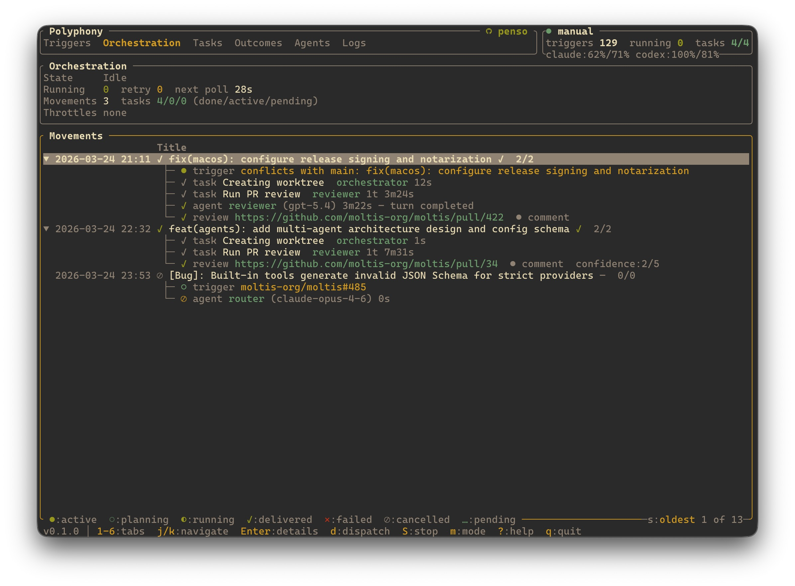

<div align="center">

<a href="https://polyphony.to"></a>

# Polyphony

Repo-native AI orchestration engine. Issue trackers to coding agents, live in your terminal.

[](https://github.com/penso/polyphony/actions/workflows/ci.yml)
[](justfile)
[](Cargo.toml)
[](LICENSE.md)

[Install](#install) - [Triggers](#triggers) - [Agents](#agents) - [Documentation](#documentation) - [Development](#development)



</div>

---

Polyphony connects your issue trackers to AI coding agents, runs them in isolated workspaces, and shows everything live in a terminal dashboard.

Inspired by [OpenAI Symphony](https://github.com/openai/symphony), Polyphony brings the same workflow-contract orchestration model to local repositories — but with multiple trigger sources and multiple agent backends.

## Triggers

Polyphony watches for work from multiple sources:

- **GitHub** — issues and pull requests
- **GitLab** — issues via GraphQL
- **Linear** — issues via GraphQL
- **Beads** — local Dolt-backed issue tracking

## Agents

Plug in any combination of AI coding agents:

- **Claude** — Anthropic's CLI agent
- **Codex** — OpenAI's Codex CLI via app-server
- **Copilot** — GitHub Copilot CLI
- **Pi** — Warp's Pi agent via native RPC
- **OpenAI Chat** — any OpenAI-compatible API (OpenRouter, Kimi, etc.)
- **ACP / ACPX** — Agent Communication Protocol agents and bridges

Each agent gets its own workspace (worktree, directory, or clone), a shared workflow policy, retries with fallback chains, and budget-aware throttling.

## Web UI

Polyphony includes a web interface that runs alongside the terminal dashboard. When `daemon.listen_port` is set, both the TUI and the web UI are available simultaneously:

- **SSR dashboard** — server-rendered pages for triggers, movements, agents, tasks, and logs
- **GraphQL API** — query and mutate runtime state, with an interactive playground at `/graphql`
- **WebSocket subscriptions** — real-time state updates via GraphQL subscriptions at `/graphql/ws`
- **Jinja templates** — HTML templates in `crates/httpd/templates/`, easy to customize

```bash
just httpd          # TUI + web UI on port 8080
just httpd 3000     # TUI + web UI on custom port
just httpd-only     # web UI only (no TUI), port 8080
```

Or configure `daemon.listen_port` in your workflow config to always enable the web UI.

## Install

```bash
brew install penso/polyphony/polyphony
```

Or build from source:

```bash
cargo install --path crates/cli
```

Then run it inside any git repository:

```bash
polyphony
```

On first start, Polyphony creates a default config at `~/.config/polyphony/config.toml` and seeds repo-local agent prompts in `.polyphony/agents/`.

## Documentation

Full reference material lives in [`docs/`](docs/src):

- [Introduction](docs/src/introduction.md)
- [Getting Started](docs/src/getting-started.md)
- [Workflow Configuration](docs/src/workflow.md)
- [Built-In Tools](docs/src/tools.md)
- [Provider Runtimes](docs/src/providers.md)
- [Architecture](docs/src/architecture.md)

## Development

```bash
just format   # format code
just lint     # clippy + checks
just test     # run tests
just httpd    # run web UI on port 8080
```

## License

MIT
