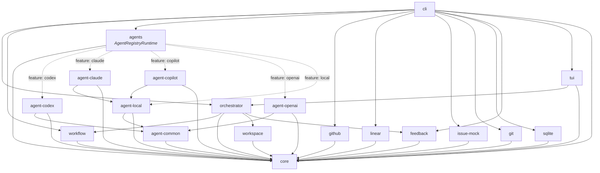
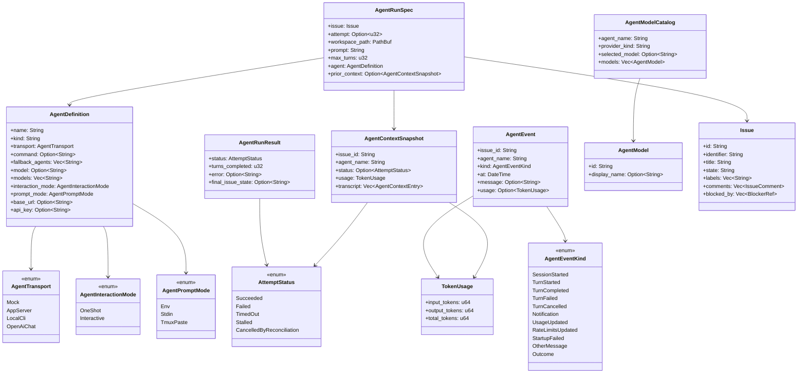
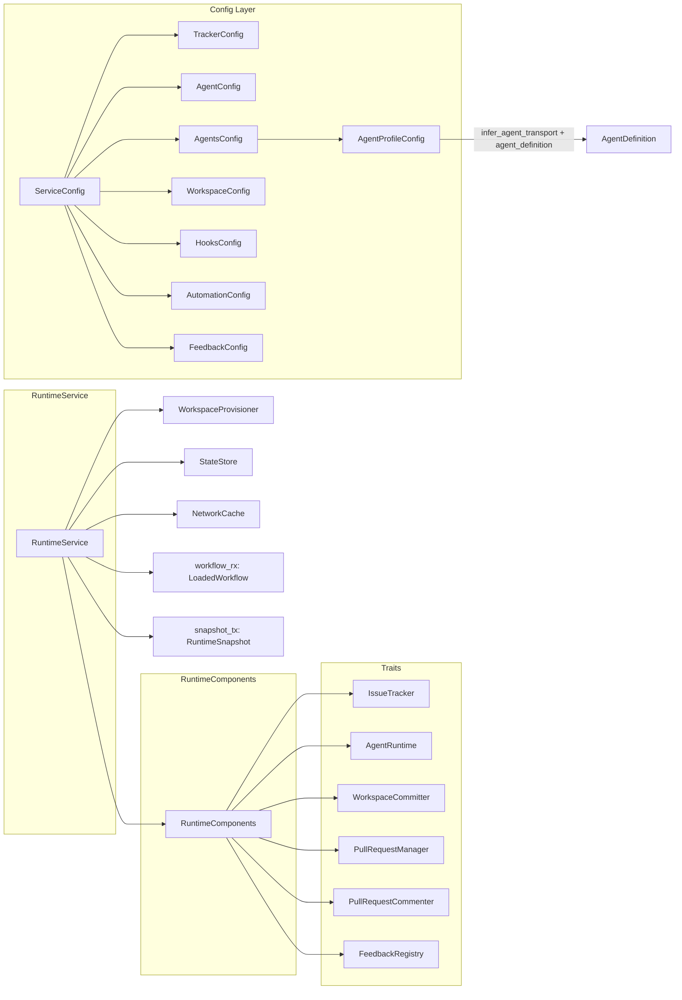
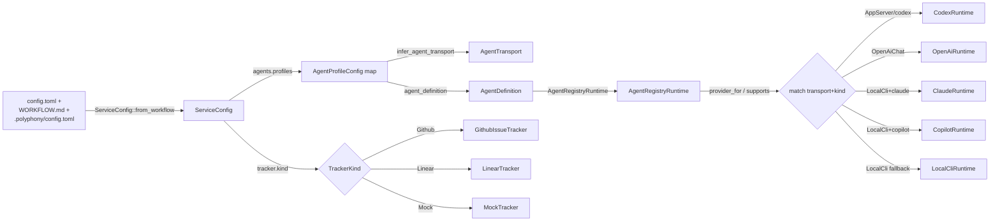

# Architecture Diagrams

Visual maps of the crate graph, trait hierarchy, and data flow.
See [Architecture](./architecture.md) for the prose description.

## Crate Dependency Graph

Solid arrows are unconditional dependencies. Dashed arrows are behind
Cargo feature flags.

## Core Traits and Implementations

Every runtime seam is a trait in `polyphony-core`. Concrete implementations
live in their own crates.

```mermaid
classDiagram
    class AgentRuntime {
        <<trait>>
        +component_key() String
        +start_session(spec, event_tx) Option~AgentSession~
        +run(spec, event_tx) AgentRunResult
        +fetch_budgets(agents) Vec~BudgetSnapshot~
        +discover_models(agents) Vec~AgentModelCatalog~
    }

    class AgentProviderRuntime {
        <<trait>>
        +runtime_key() String
        +supports(agent) bool
        +start_session(spec, event_tx) Option~AgentSession~
        +run(spec, event_tx) AgentRunResult
        +fetch_budget(agent) Option~BudgetSnapshot~
        +discover_models(agent) Option~AgentModelCatalog~
    }

    class AgentSession {
        <<trait>>
        +run_turn(prompt) AgentRunResult
        +stop()
    }

    class IssueTracker {
        <<trait>>
        +component_key() String
        +fetch_candidate_issues(query) Vec~Issue~
        +fetch_issues_by_states(slug, states) Vec~Issue~
        +fetch_issues_by_ids(ids) Vec~Issue~
        +fetch_issue_states_by_ids(ids) Vec~IssueStateUpdate~
        +fetch_budget() Option~BudgetSnapshot~
    }

    class WorkspaceProvisioner {
        <<trait>>
        +component_key() String
        +ensure_workspace(request) Workspace
        +cleanup_workspace(request)
    }

    class WorkspaceCommitter {
        <<trait>>
        +component_key() String
        +commit_and_push(request) Option~WorkspaceCommitResult~
    }

    class PullRequestManager {
        <<trait>>
        +component_key() String
        +ensure_pull_request(request) PullRequestRef
        +merge_pull_request(pr)
    }

    class PullRequestCommenter {
        <<trait>>
        +component_key() String
        +comment_on_pull_request(pr, body)
    }

    class FeedbackSink {
        <<trait>>
        +component_key() String
        +descriptor() FeedbackChannelDescriptor
        +send(notification)
    }

    class StateStore {
        <<trait>>
        +bootstrap() StoreBootstrap
        +save_snapshot(snapshot)
        +record_run(run)
        +record_budget(snapshot)
    }

    class NetworkCache {
        <<trait>>
        +load() CachedSnapshot
        +save(snapshot)
    }

    class AgentRegistryRuntime {
        -providers: Vec~AgentProviderRuntime~
        +new()
        -provider_for(agent) AgentProviderRuntime
    }

    class CodexRuntime {
        +runtime_key() "agent:codex"
    }
    class ClaudeRuntime {
        -local: LocalCliRuntime
        +runtime_key() "agent:claude"
    }
    class CopilotRuntime {
        -local: LocalCliRuntime
        +runtime_key() "agent:copilot"
    }
    class OpenAiRuntime {
        -http: reqwest Client
        +runtime_key() "agent:openai"
    }
    class LocalCliRuntime {
        -supported_kinds: Vec~String~
        -fallback_transport: bool
        +runtime_key() "agent:local"
    }

    class GithubIssueTracker
    class LinearTracker
    class MockTracker
    class MockAgentRuntime

    class GitWorkspaceProvisioner
    class GitWorkspaceCommitter
    class GithubPullRequestCommenter
    class GithubPullRequestManager
    class WorkspaceManager

    class SqliteStateStore
    class FeedbackRegistry
    class TelegramFeedbackSink
    class WebhookFeedbackSink

    AgentRuntime <|.. AgentRegistryRuntime
    AgentRuntime <|.. MockAgentRuntime

    AgentProviderRuntime <|.. CodexRuntime
    AgentProviderRuntime <|.. ClaudeRuntime
    AgentProviderRuntime <|.. CopilotRuntime
    AgentProviderRuntime <|.. OpenAiRuntime
    AgentProviderRuntime <|.. LocalCliRuntime

    AgentRegistryRuntime o-- AgentProviderRuntime : contains 0..*

    ClaudeRuntime *-- LocalCliRuntime : wraps
    CopilotRuntime *-- LocalCliRuntime : wraps

    IssueTracker <|.. GithubIssueTracker
    IssueTracker <|.. LinearTracker
    IssueTracker <|.. MockTracker

    WorkspaceProvisioner <|.. GitWorkspaceProvisioner
    WorkspaceProvisioner <|.. WorkspaceManager
    WorkspaceCommitter <|.. GitWorkspaceCommitter

    PullRequestManager <|.. GithubPullRequestManager
    PullRequestCommenter <|.. GithubPullRequestCommenter

    FeedbackSink <|.. TelegramFeedbackSink
    FeedbackSink <|.. WebhookFeedbackSink
    FeedbackRegistry o-- FeedbackSink : contains 0..*

    StateStore <|.. SqliteStateStore
```

## Agent Data Flow

Structs and enums involved in dispatching an agent run.

## Orchestrator Composition

How `RuntimeService` assembles its trait-object dependencies.

## Config to Runtime Flow

How TOML configuration turns into live runtime providers.

